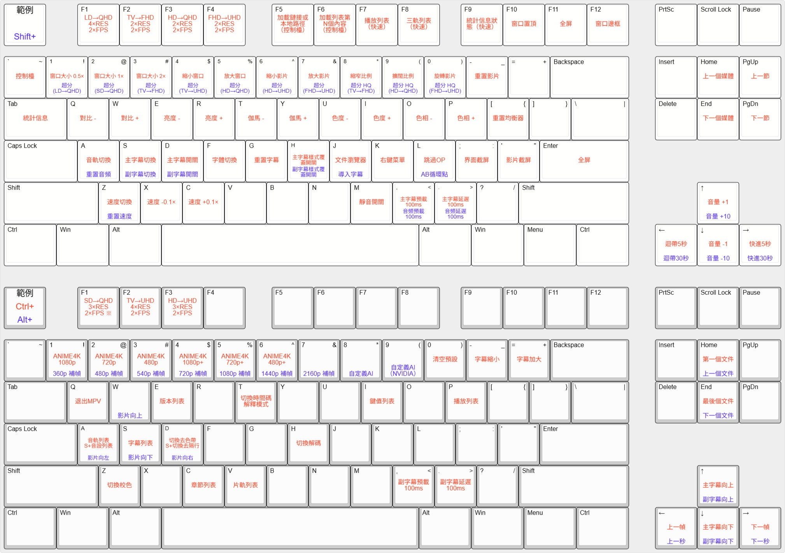

# mpv-cfg
MPV configuration based on [MPV-Lazy](https://github.com/hooke007/MPV_lazy) (Obsoleted, use [MPV_PlayKit](https://github.com/hooke007/mpv_PlayKit)). Fully controllable by Keyborad.

## Installation 安裝
Download the latest version with vsNV from [MPV_PlayKit](https://github.com/hooke007/mpv_PlayKit) and unarchive it to the intended location. And use this repo's configuration to replace the existing configuration.

從[MPV_PlayKit](https://github.com/hooke007/mpv_PlayKit)中下載最新版本（含vsNV）竝解壓至目標路徑。並用本倉庫配置替代已有配置。

## Localization 本地化
Default Language（默認語言）: Traditional Chinese

To change the language, please open "portable_config/mpv.conf" with a text editor such as Notepad++ and change "input-conf" to the language you require.

欲想更改語言，請用諸如Notepad++等文本編輯器開啓「portable_config/mpv.conf」，然後將「input-conf」改成閣下欲用語言。

### Menu 菜單

#### English (Default)

```
input-conf = "~~/input_en.conf" #English
```

#### Traditional Chinese 繁中

```
input-conf = "~~/input_tc.conf" #Traditional Chinese
```

#### Japanese 日本語

```
input-conf = "~~/input_jp.conf" #Japanese
```

#### Simplified Chinese 简中

Auto Translated by opencc.
```
input-conf = "~~/input_sc.conf" #Simplified Chinese
```

### UOSC 界面

- 繁中：以`/uosc_lang/tc/lang.lua`替代`/portable_config/script/uosc/lib/lang.lua` with 
- 简中：以`/uosc_lang/sc/lang.lua`替代`/portable_config/script/uosc/lib/lang.lua` 
- No English Version

## Key Map 鍵圖

2026/02/14更新：鍵圖



## Subtitle 字幕
Please note that external subtitles must contain the media filename in order for them to be recognised.
It is recommended that subtitles be placed in a subfolder. The folder name should be "sub" or "subtitles". If you wish to use a different naming convention, you will need to edit the mpv.conf file.

外掛字幕必須包含媒體文件名、否則將無法識別。
推薦將字幕放於子文件夾中，竝命名爲「sub」或「subtitles」，若閣下欲用其他命名方式，則須在「mpv.conf」中修改。

### Change Font 字體變更

To change the font, simply press "f". The default font is "WD-XL Lubrifont, which can be changed to "Bagnard", "Amira Black" or "Arial Black". To apply the change for ASS Subtitle, press "h" for the first subtitle and/or "Shift + h" for the second subtitle to overwrite the style stated in ASS. 

變更字體請按「f」，默認字體爲「WD-XL」滑油字，可被變更爲「Bagnard」，「Amira Black」，「Arial Black」。若使用ASS字幕，請按「h」強制覆蓋主字幕，「Shift + h」強制覆蓋副字幕。

## Audio 音軌

Please note that external audio must contain the media filename in order for them to be recognised.

外掛音軌必須包含媒體文件名、否則將無法識別。

## Preset 預設
https://github.com/hooke007/MPV_lazy/wiki/3_K7sfunc

https://hooke007.github.io/unofficial/mpv_shaders.html

If your specs allow, use the VS Filter Preset.

This preset is tuned for NVIDIA RTX 4070 Super and works best for anime. It's better without hard subtitles (subtitles that are burned into the video track).

This preset use **"RIFE"** for frame interpolation and **"ESRGAN"** for super resoulution to achieve the best effect.
You can change **"RIFE"** to **"MVTools"** for lower spec PC. However, **"MVTools"**'s effect is not as good as **"RIFE"**.

If your spec is even lower, use **"Anime4K"** instead of **"ESRGAN"**.

若閣下配置允許請用VS濾鏡預設。

本預設是基於NVIDIA RTX 4070 Super調整，竝祇適用於動畫，且避免使用硬字幕。

本預設使用「RIFE」進行補幀，再以「ESRGAN「進行超分，以達到最佳效果。
若配置較低，可將「RIFE」更改爲「MVTools」，但「MVTools」效果不如「RIFE」。

若配置更差，請使用「Anime4K」取代VS濾鏡。

Use **Ctrl + 0** to remove all preset.

Use **F9** to check if the preset applied.

### Standard VS Preset 標準VS預設
- **F1** LD(360p)→QHD(1440p) 4×RES 2×FPS
- **Ctrl+F1** SD(480p)→QHD(1440p) 3×RES 2×FPS
- **F2** TV(540p)→FHD(1080p) 2×RES 2×FPS
- **F3** HD(720p)→QHD(1440p) 2×RES 2×FPS
- **F4** FHD(1080p)→UHD(2160p) 2×RES 2×FPS

### Standard Anime4K Preset 標準Anime4K預設
- **Ctrl + [1 ~ 6]:** Anime4K High Quality Preset
- **Ctrl + (Shift) + [1 ~ 6]:** Anime4K Low Quality Preset

## Font 字體

[NightFurySL2001/WD-XL-font: Source files of WD-XL Lubrifont ｜ WD-XL 滑油字 字型源文件](https://github.com/NightFurySL2001/WD-XL-font/)
